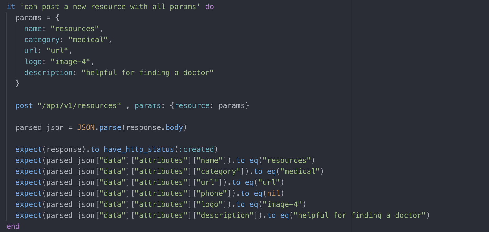
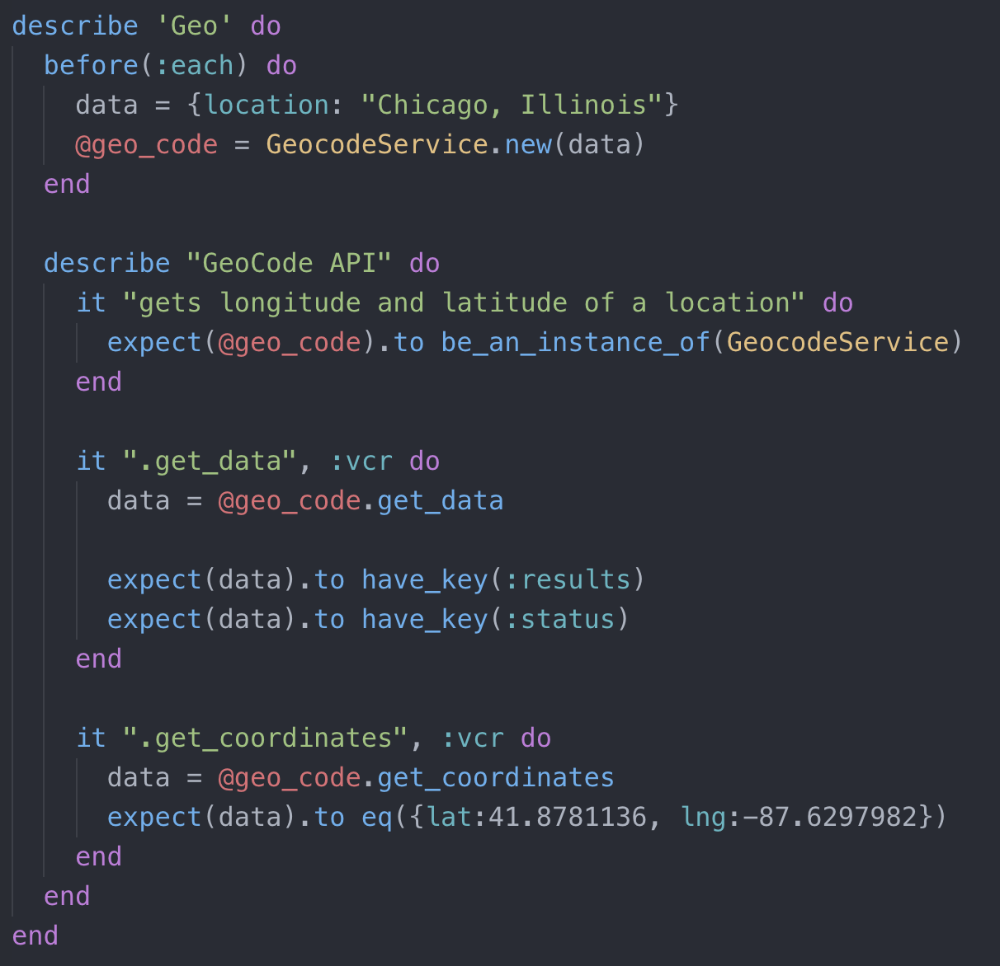

# Civilianize ME

Civilianize me is an API made for veterans to be able to have easier access to resources
once they leave military service.
In this API we gathered a lot of great resources and we have grouped them by catergory for easy searches.
You have also have the possibility of finding the neared VA facilities based on the location you input.

## Getting started
Clone this repository to your local machine by running this command:
```
git clone https://github.com/maddyg91/civilianize-me-BE.git
```
then: 
```
   cd civilianize-me-BE
```
You should now be in the correct directory.

Make sure your ruby version is `2.5.1`, you can check this by typing `ruby -v` in your terminal. If your version is different we suggest updating to version `2.5.1`.

After run these commands:
```
  bundle
  rake db:{drop,create,migrate,seed}
```
You should now be good to start exploring!

## Endpoints

The base URL you can use is https://powerful-reef-36769.herokuapp.com or http://localhost:3000 if you want to run it locally.

The available endpoints are:

# GET /api/v1/va_locations

  this endpoint takes a `location` param in the fromat `city,state`.
  an example response looks like this:
  
  ```
  {
    "data": [
        {
            "id": "1",
            "type": "resources",
            "attributes": {
                "name": "Transition and Care Management for New Veterans (OEF/OIF/OND)",
                "category": "General",
                "url": "https://www.oefoif.va.gov/",
                "phone": null,
                "logo": "https://i.imgur.com/mdkP2GJ.png",
                "description": "Voluptates fugiat aut. Odit voluptatibus iusto. Ratione dolorem cum. Laborum repellat non. Voluptatum incidunt delectus."
            }
        },
        {
            "id": "2",
            "type": "resources",
            "attributes": {
                "name": "VSO Lookup",
                "category": "General",
                "url": "https://nvf.org/veteran-service-officers/",
                "phone": null,
                "logo": "https://i.imgur.com/ayiCqWh.png",
                "description": "Autem sapiente eaque. Eius officiis iure. Est sint molestiae. Repellendus a odio. Iusto culpa ex."
            }
        },
        {
            "id": "3",
            "type": "resources",
            "attributes": {
                "name": "National Labor Exchange (USNLX) Job Search",
                "category": "Employment",
                "url": "https://veterans.usnlx.com/",
                "phone": null,
                "logo": "https://i.imgur.com/19c7J4e.png",
                "description": "Iure quisquam non. Voluptatum beatae eos. Amet expedita id. Dolores odio natus. Praesentium commodi placeat."
            }
        }
    ]
 }
```


# GET /api/v1/resources
This return all the resources available in the database, it is possible to narrow the search down by adding a `category` param.  
These are the category options: Benefits, General, Crisis, Healthcare,Employment, Housing, OEF/OIF/OND, Skill Training

 an example response with the category of General looks like this:

```
{
    "data": [
        {
            "id": "1",
            "type": "resources",
            "attributes": {
                "name": "Transition and Care Management for New Veterans (OEF/OIF/OND)",
                "category": "General",
                "url": "https://www.oefoif.va.gov/",
                "phone": null,
                "logo": "https://i.imgur.com/mdkP2GJ.png",
                "description": "Voluptates fugiat aut. Odit voluptatibus iusto. Ratione dolorem cum. Laborum repellat non. Voluptatum incidunt delectus."
            }
        },
        {
            "id": "2",
            "type": "resources",
            "attributes": {
                "name": "VSO Lookup",
                "category": "General",
                "url": "https://nvf.org/veteran-service-officers/",
                "phone": null,
                "logo": "https://i.imgur.com/ayiCqWh.png",
                "description": "Autem sapiente eaque. Eius officiis iure. Est sint molestiae. Repellendus a odio. Iusto culpa ex."
            }
        },
    ]
}
```


# GET /api/v1/resources/:id

```
{
    "data": [
        {
            "id": "23",
            "type": "resource",
            "attributes": {
                "name": "Military One Source",
                "category": "General",
                "url": "https://www.militaryonesource.mil/",
                "phone": "(800) 342-9647",
                "logo": "https://i.imgur.com/Ggsrbto.png",
                "description": "Repudiandae asperiores atque. Rerum corporis expedita. Ipsum voluptate voluptates. In odio cumque. Minus natus quod."
            }
        }
    ]
}
```

# GET /api/v1/favorites
```
{
    "data": [
        {
            "id": "1",
            "type": "favorite",
            "attributes": {
                "name": "Military One Source",
                "category": "General",
                "url": "https://www.militaryonesource.mil/",
                "phone": "(800) 342-9647",
                "logo": "https://i.imgur.com/Ggsrbto.png",
                "description": "Repudiandae asperiores atque. Rerum corporis expedita. Ipsum voluptate voluptates. In odio cumque. Minus natus quod."
            }
        },
        {
            "id": "2",
            "type": "favorite",
            "attributes": {
                "name": "Veteran Crisis Line",
                "category": "Crisis",
                "url": "https://www.lifeline-va-chat.org/SightMaxAgentInterfaceMobile/PreChatSurvey.aspx?accountID=1",
                "phone": "(800) 273-8255",
                "logo": "https://i.imgur.com/Inh9jMv.png",
                "description": "Sed voluptatem repellendus. Placeat eveniet modi. Exercitationem ut earum. Maiores cumque ad. Cum harum inventore."
            }
        }
    ]
}
```
# GET /api/v1/favorites/:id
```
{
    "data": {
        "id": "2",
        "type": "favorite",
        "attributes": {
            "name": "Veteran Crisis Line",
            "category": "Crisis",
            "url": "https://www.lifeline-va-chat.org/SightMaxAgentInterfaceMobile/PreChatSurvey.aspx?accountID=1",
            "phone": "(800) 273-8255",
            "logo": "https://i.imgur.com/Inh9jMv.png",
            "description": "Sed voluptatem repellendus. Placeat eveniet modi. Exercitationem ut earum. Maiores cumque ad. Cum harum inventore."
        }
    }
}
```
# PUT /api/v1/favorites/:id
params that are required: `name`, `category`, `url`, `phone`, `logo`, `description`. They are all required in string format

# POST /api/v1/favorites
params required: `name`, `category`, `url`, `phone`, `logo`, `description`.

```
   {
       "id": 1,
       "name": "Military One Source",
       "category": "General",
       "url": "https://www.militaryonesource.mil/",
       "phone": "(800) 342-9647",
       "created_at": "2019-04-10T20:34:23.042Z",
       "updated_at": "2019-04-10T20:34:23.042Z",
       "description": "Repudiandae asperiores atque. Rerum corporis expedita. Ipsum voluptate voluptates. In odio cumque.                            Minus natus quod.",
       "logo": "https://i.imgur.com/Ggsrbto.png"
   }

```
# DELETE /api/v1/favorites/:id
  Allows you to delete any favorite.
  

## How to run the test suite


  If you are interested in running out test suit you can do so by using the command `rspec`.
  We have both model, service and integration tests written and our Coverage using SimpleCov is as 100%.

  here are some examples of our tests:
  

  


## Deployment instructions

  Our app is deployed on https://powerful-reef-36769.herokuapp.com

## Built With: Technologies and Versions
* [Ruby 2.5.1](https://ruby-doc.org/core-2.5.1/)
* [Rails 5.2.3](https://guides.rubyonrails.org/)
* [Trello for Project Magnam]()
* [Faraday](https://github.com/lostisland/faraday)
* [OmniAuth GitHub](https://github.com/omniauth/omniauth-github)
* [Mailgun](https://www.mailgun.com/)
* [Heroku](https://www.heroku.com/)
* [RSpec](http://rspec.info/)
* [Capybara](https://github.com/teamcapybara/capybara/blob/3.12_stable/README.md)
* [vcr](https://github.com/vcr/vcr)
* [Stimulus](https://github.com/stimulusjs/stimulus)
* [will_paginate](https://github.com/mislav/will_paginate)
* [acts-as-taggable-on](https://github.com/mbleigh/acts-as-taggable-on)
* [webpacker](https://github.com/rails/webpacker)
* [selenium-webdriver](https://www.seleniumhq.org/docs/03_webdriver.jsp)
* [chromedriver-helper](http://chromedriver.chromium.org/)

## Authors
**[Michael Clampett](https://github.com/SyntheticAutomation)**
**[Maddie Jones](https://github.com/maddyg91)**
**[Jimmy Smith](https://github.com/JSmith23)**
